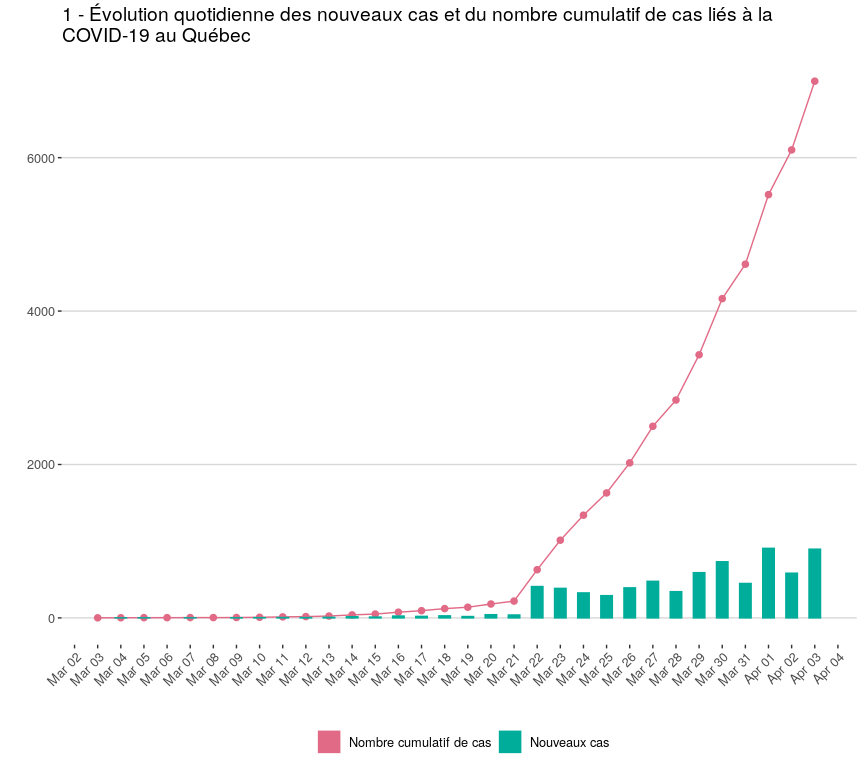
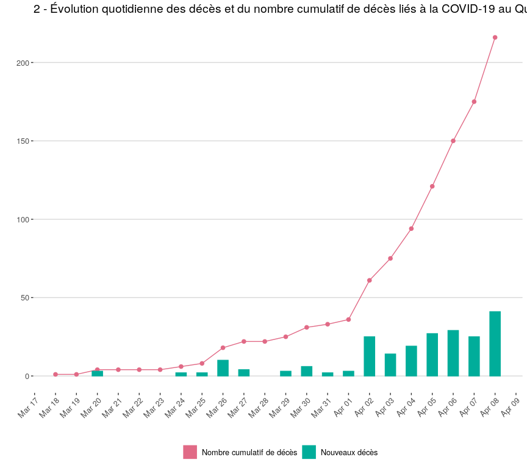
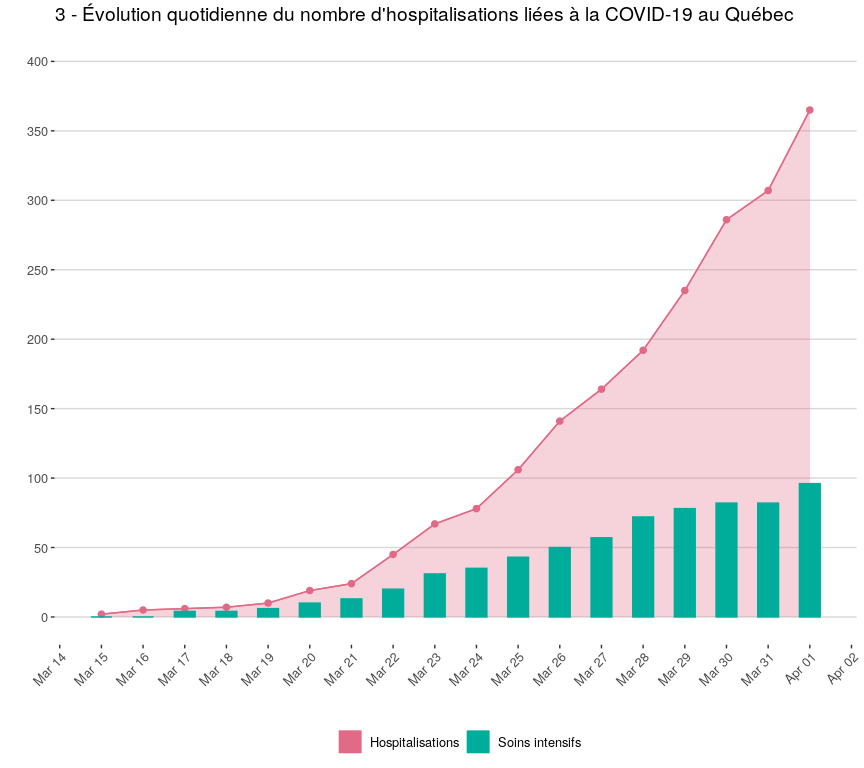
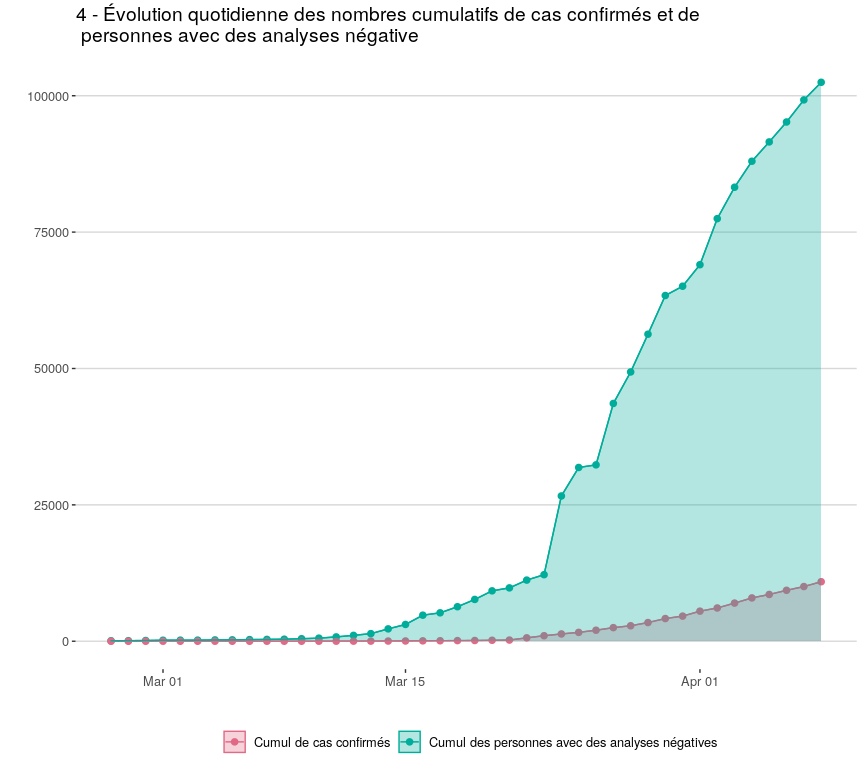

<!-- README.md is generated from README.Rmd. Please edit that file -->

# Quebec Covid19 data

## UPDATE April 8, 2020

The data is now in `.csv` format directly, so no need to parse JSON.

## March 31, 2020

I parsed the `JSON` behind [the INSPQ
highcharts](https://www.inspq.qc.ca/covid-19/donnees) using `R` and
reproduced the graphs with `ggplot2`.

  - The cleaned data used to generate these graphs can be found in the
    [`data`](https://github.com/sahirbhatnagar/covid19/tree/master/data)
    folder.  
  - The code used to scrape the data, clean it and plot it can be found
    at <http://sahirbhatnagar.com/covid19/>.  
  - The `R` script can be found in the
    [`bin`](https://github.com/sahirbhatnagar/covid19/tree/master/bin)
    folder

# Load Required Packages

# 1- Évolution quotidienne des nouveaux cas et du nombre cumulatif de cas liés à la COVID-19 au Québec

<!-- -->

# 2 - Évolution quotidienne des décès et du nombre cumulatif de décès liés à la COVID-19 au Québec

<!-- -->

# 3 - Évolution quotidienne du nombre d’hospitalisations liées à la COVID-19 au Québec

<!-- -->

# 4 - Évolution quotidienne des nombres cumulatifs de cas confirmés et de personnes avec des analyses négative

<!-- -->

# 7 - Cas confirmés selon le groupe d’âge (répartition et taux pour 100 000)

    ## Parsed with column specification:
    ## cols(
    ##   ID = col_double(),
    ##   `Groupe d'âge` = col_character(),
    ##   type = col_character(),
    ##   value = col_double()
    ## )

<!-- -->

# Code of Conduct

Please note that the ‘covid19’ project is released with a [Contributor
Code of Conduct](CODE_OF_CONDUCT.md). By contributing to this project,
you agree to abide by its terms.
