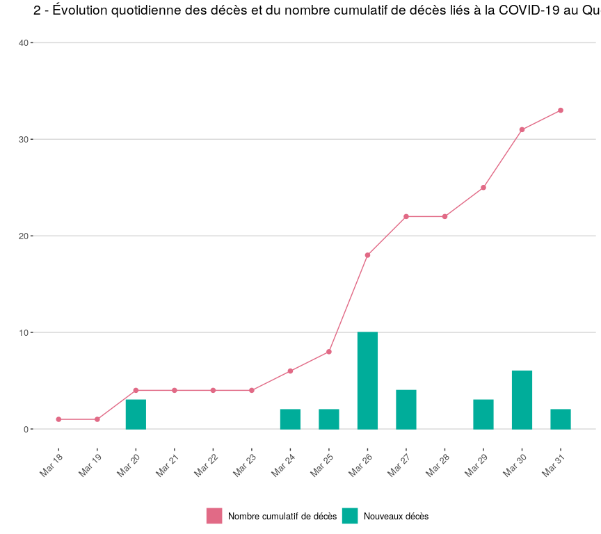
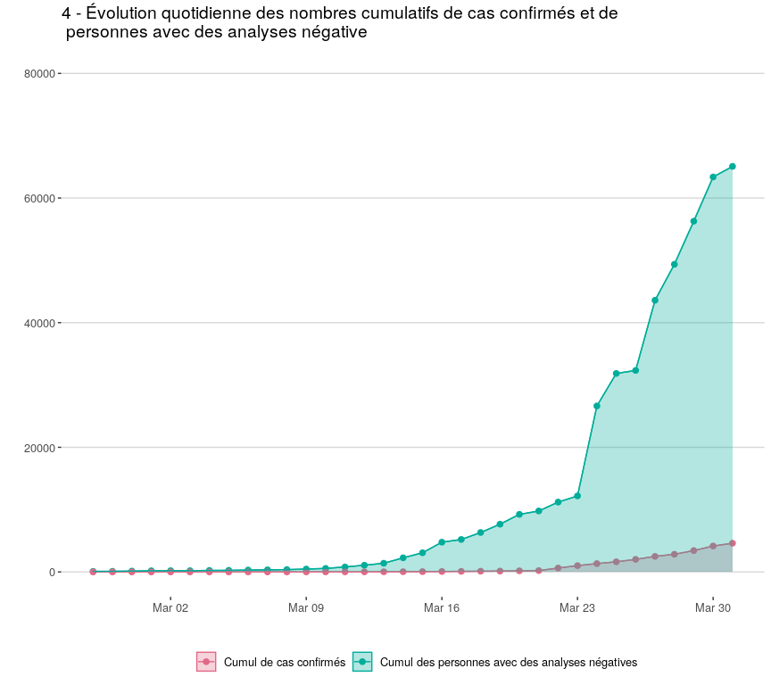

<!-- README.md is generated from README.Rmd. Please edit that file -->

# Quebec Covid19 data

I parsed the `JSON` behind [the INSPQ
highcharts](https://www.inspq.qc.ca/covid-19/donnees) using `R` and
reproduced the graphs. The cleaned data used to generate these graphs
can be found in the `data` folder. The code used to scrape the data,
clean it and plot it can be found at
<http://sahirbhatnagar.com/covid19/>.

<!-- --><!-- --><!-- --><!-- --><!-- -->
